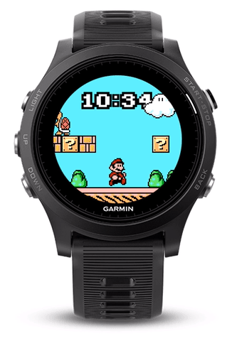

# Super Mario Bros

An animated Super Mario Bros watchface for Garmin's wearable lineup.
8-bit gaming nostalgia! Animates whenever you look at your watch.

## How to install

You need to "sideload" the watchface on your device. Don't worry, it's really easy!

1. Figure out what model device you have (fenix5, vivoactive HR, fr235, etc).
2. Look for the corresponding folder in "**release**", ie "release/fenix5"
3. In this folder, there's a "**clock.prg**" file.
4. Connect your device to your computer.
5. Your device is now available as a removable storage device.
6. Copy the "**clock.prg**" file inside the "**/GARMIN/APPS**" directory on your device.
7. "Safely remove" or "Eject" your device.
8. After a few moments, Mario is on your device!
